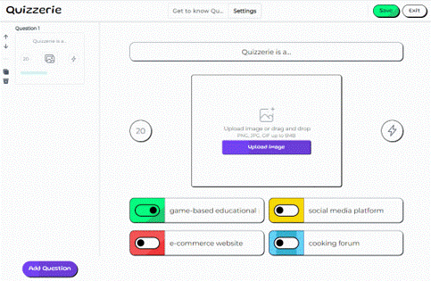

# Quizzerie
_A Reflection of Kahoot!_

## Table of Contents

- [What is Quizzerie?](#what-is-quizzerie)
- [Methodology](#methodology)
- [Technology](#technology)
- [Why Quizzerie?](#why-quizzerie)
- [Challenges](#challenges)

## What is Quizzerie?

Quizzerie is a game-based quiz platform designed to revolutionize educational knowledge assessment. It allows teachers to create pre-set quizzes that students can answer in real-time during class. The platform instantly provides both teachers and students with scores, calculated based on the accuracy and speed of the students' answers.

## Methodology

Quizzerie employs a mix of robust technologies to provide an interactive and reliable user experience:

- **Frontend**: Built using Next.js and Tailwind CSS frameworks.
- **Backend**: Developed using the Laravel framework.
- **Database**: MySQL database is used for data storage.
- **Real-Time Connection**: Soketi with Pusher Protocol v7 is integrated for real-time updates on questions, answers, and scores.

## Technology

Quizzerie is developed using the latest and most reliable web technologies to ensure high performance and reliability.

## Why Quizzerie?

- **Efficient Formative Assessment**: Enables immediate student assessment by quickly providing accurate results.
- **Accessible Design**: The UI is carefully crafted to be simple yet effective, aimed at the targeted educational audience.
- **Engaging Experience**: Adds an element of fun to education through a scoring system and student ranking.

## Challenges

- Implementing real-time connections between clients and the server using WebSocket technology.
- Designing a user-friendly and visually appealing interface.
- Creating a robust database schema.
- Building an API to process and serve the interface with data based on specific requests.

